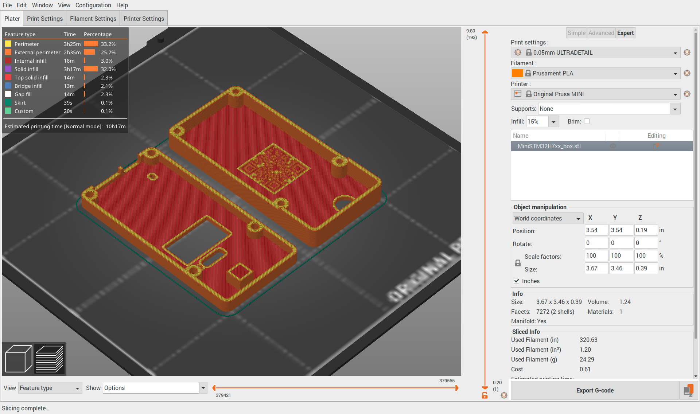

# Prusa-slicer for 64-bit Raspberry Pi 4


Build notes for Prusa-slicer, compiled for raspberry pi 4 running 2020-08-20-raspios-buster-arm64. Prusa-slicer is a tool for 3d printing. 

*This is a binary for 64-bit raspberry pi os. If you are running 32-bit raspberry pi os, you can download [32-bit appimages for Prusa-Slicer on raspberry](https://github.com/davidk/PrusaSlicer-ARM.AppImage) instead.*

## Installation
To install prusa-slicer in /usr/bin/prusa-slicer, download the [Debian binary package](https://github.com/koendv/prusa-slicer-raspberrypi/releases/) and install using
```
cd ~/Downloads
sudo apt-get update
sudo dpkg -i ./libcgal-dev_5.1-1_arm64.deb
sudo dpkg -i ./prusa-slicer_2.3.0-alpha3_arm64.deb
```
To remove:
```
sudo dpkg -r prusa-slicer
sudo dpkg -r libcgal-dev
```
The remainder of this document details how to build prusa-slicer on raspbian.
## Build Notes
Install prerequisites:
```
apt-get update
apt-get install cmake libboost-all-dev libtbb-dev libcurl4-openssl-dev libwxgtk3.0-dev libeigen3-dev libglew-dev libcereal-dev
```
Compile libcgal-dev from sources, following the procedure on the [debian wiki](https://wiki.debian.org/SimpleBackportCreation):
```
sudo apt-get install packaging-dev debian-keyring devscripts equivs
```
Add "deb-src http://deb.debian.org/debian/ testing main" to /etc/apt/sources.conf
```
sudo apt update
sudo apt source libcgal-dev/testing
cd cgal-5.1/
sudo  mk-build-deps --install --remove
dch --bpo
fakeroot debian/rules binary
```
Install libcgal-dev
```
cd ..
sudo dpkg -i ./libcgal-dev_5.1-1~bpo10+1_arm64.deb
```

Download and compile sources:
```
git clone https://github.com/prusa3d/PrusaSlicer
mkdir build
cd build
cmake ../PrusaSlicer -DCMAKE_BUILD_TYPE=Release -DSLIC3R_WX_STABLE=1 -DSLIC3R_FHS=1
make DESTDIR=$PWD/deb install
```
## Create debian package
Create the debian control file:
```
mkdir deb/DEBIAN
cat > deb/DEBIAN/control <<EOD
Package: prusa-slicer
Version: 2.3.0-alpha3
Maintainer: Koen <koen@mcvax.org>
Priority: optional
Section: science
Bugs: https://github.com/koendv/prusa-slicer-raspberrypi/issues
Homepage: https://github.com/koendv/prusa-slicer-raspberrypi
Depends: cmake, libboost-all-dev, libtbb-dev, libcurl4, libwxgtk3.0-dev, libeigen3-dev, libglew-dev, libcereal-dev, libcgal-dev
Architecture: arm64
Description: Prusa-Slic3r 2.3.0-alpha3
 compiled for raspberry pi 4 running 2020-08-20-raspios-buster-arm64.
EOD
```
Create the debian package:
```
fakeroot dpkg-deb -b ./deb/ .
```
This produces the debian package file prusa-slicer_2.3.0-alpha3_arm64.deb

This completes the build notes.

not truncated.
