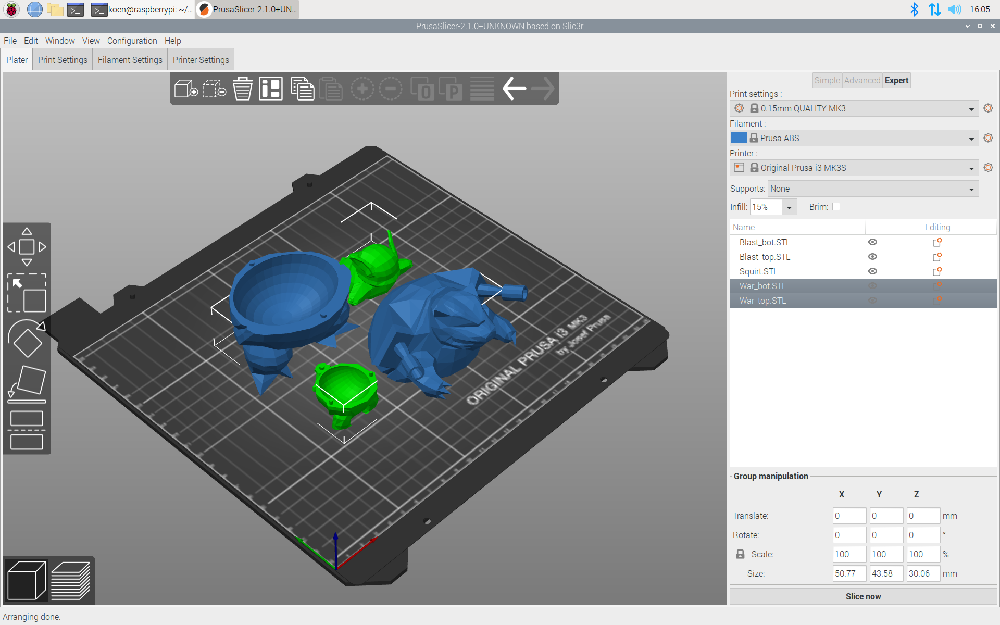

# Prusa-slicer for Raspberry Pi 4


Build notes for Prusa-slicer, compiled for raspberry pi 4 running 2019-09-26-raspbian-buster. Prusa-slicer is a tool for 3d printing. 
## Installation
To install prusa-slicer in /usr/local/bin/prusa-slicer, download the [Debian binary package](https://github.com/koendv/prusa-slicer-raspberrypi/releases/) and install using
```
cd ~/Downloads
sudo apt install ./prusa-slicer_2.1.0_armhf.deb
```
To remove:
```
sudo dpkg -r prusa-slicer
```
The remainder of this document details how to build prusa-slicer on raspbian.
## Build Notes
Install prerequisites:
```
apt-get update
apt-get install cmake libboost-all-dev libtbb-dev libcurl4-openssl-dev libwxgtk3.0-dev libeigen3-dev libglew-dev libcereal-dev
```
Download and compile sources:
```
wget https://github.com/prusa3d/PrusaSlicer/archive/version_2.1.0.tar.gz
tar xvf version_2.1.0.tar.gz
mkdir build
cd build
cmake ../PrusaSlicer-version_2.1.0 -DCMAKE_BUILD_TYPE=Release -DSLIC3R_WX_STABLE=1
make DESTDIR=$PWD/deb install
```
## Create debian package
Create the debian control file:
```
mkdir deb/DEBIAN
cat > deb/DEBIAN/control <<EOD
Package: prusa-slicer
Version: 2.1.0
Maintainer: Koen <koen@mcvax.org>
Priority: optional
Section: science
Bugs: https://github.com/koendv/prusa-slicer-raspberrypi/issues
Homepage: https://github.com/koendv/prusa-slicer-raspberrypi
Depends: cmake, libboost-all-dev, libtbb-dev, libcurl4, libwxgtk3.0-dev, libeigen3-dev, libglew-dev, libcereal-dev
Architecture: armhf
Description: Prusa-Slic3r 2.1.0
 compiled for raspberry pi 4 running 2019-09-26-raspbian-buster[-lite.]
EOD
```
Create the debian package:
```
fakeroot dpkg-deb -b ./deb/ .
```
This produces the debian package file prusa-slicer_2.1.0_armhf.deb

This completes the build notes.

not truncated.
